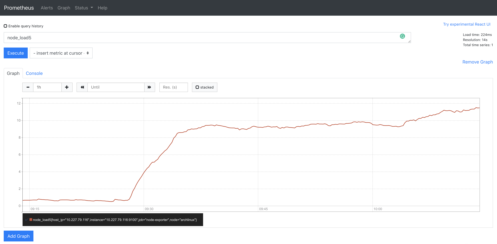
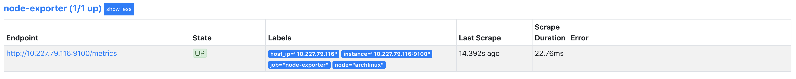

# 在 K8s 单节点集群上手动搭建 Prometheus

> 本文的目标读者是刚刚开始接触监控系统，以及对 Prometheus 知之甚少的弱势群体（一如写就本文时候的笔者）
>
>
>
> 本文中用于搭建 Prometheus 的环境：
>
> - K8s version: 1.19.3
>- Prometheus version: 2.22.0
> - 操作系统：Archlinux at 2020.11
>- 配置了 hosts，Devbox 的域名为 devbox
>
> ⚠️ 请注意：本文列出的命令行参数需要根据当前环境稍作调整（比如 Prometheus 二进制包版本等）
>
>
>
> 这里列出了一些推荐的前置阅读项：
>
> 1. [可观测性：概念和最佳实践](https://github.com/lichuan0620/k8s-sre-learning-notes/blob/master/observability/OBSV-101.md) 在其中介绍了可观测性的各类基本概念
>2. [ 初步认识 Prometheus](https://github.com/lichuan0620/k8s-sre-learning-notes/blob/master/prometheus/PROM-101.md) 介绍了 Prometheus 项目
> 3. [Prometheus 官方网站的介绍](https://prometheus.io/docs/introduction/overview/)

## 目标

既然是在 K8s 上手动搭建 Prometheus，那我们在这里有两点规约

1. 刻意不去使用 Helm-Chart，Prometheus Operator 之类的快捷部署方式，这里列出来供参考：

   1. Prometheus 社区维护的 [Helm chart](https://github.com/prometheus-community/helm-charts)
   2. [Prometheus Operator](https://github.com/prometheus-operator/prometheus-operator)
   3. [Kube-Prometheus](https://github.com/prometheus-operator/kube-prometheus)
3. 在 K8s 上搭建 Prometheus，即 K8s 负责管理 Prometheus 服务，和上面提到的 Prometheus Operator 不同的是，在这里我们要自己写相关的各类 YAML 配置文件。
3. 列出如下监控目标：
   1. Prometheus 
   2. Node exporter
   3. Kubelet
   4. Cadvisor
   5. ApiServer

那我们开始吧！

## 裸机运行 Prometheus 概念验证

首先第一直觉是在裸机上做概念验证，先跑起来再对进一步的配置做实验，最终，当我们理解了 Prometheus 的各个配置项之后，重新部署到 K8s 上应当是信手拈来。

> 我想尝试偷懒，搜索教程博客之后发现都不清不楚并且大部分都已经过期了，结果浪费半天时间还得老老实实去官网读文档。

### 安装 Prometheus

根据[文档](https://prometheus.io/docs/prometheus/2.22/getting_started/)的描述，直接在[这里](https://prometheus.io/download/)下载对应的预编译二进制包：

```bash
curl -LO "https://github.com/prometheus/prometheus/releases/download/v2.22.0/prometheus-2.22.0.linux-amd64.tar.gz"
tar -zxvf prometheus-2.22.0.linux-amd64.tar.gz
cd prometheus-2.22.0.linux-amd64
./prometheus --version
# expected output should be like this:
# prometheus, version 2.22.0 (branch: HEAD, revision: 0a7fdd3b76960808c3a91d92267c3d815c1bc354)
#  build user:    root@6321101b2c50
#  build date:    20201015-12:29:59
#  go version:    go1.15.3
#  platform:     linux/amd64
```

查看一下目录，发现自带一个配置文件 prometheus.yml：

```yaml
# my global config
global:
 scrape_interval:   15s # Set the scrape interval to every 15 seconds. Default is every 1 minute.
 evaluation_interval: 15s # Evaluate rules every 15 seconds. The default is every 1 minute.
 # scrape_timeout is set to the global default (10s).
# Alertmanager configuration
alerting:
 alertmanagers:
 - static_configs:
  - targets:
   # - alertmanager:9093
# Load rules once and periodically evaluate them according to the global 'evaluation_interval'.
rule_files:
 # - "first_rules.yml"
 # - "second_rules.yml"
# A scrape configuration containing exactly one endpoint to scrape:
# Here it's Prometheus itself.
scrape_configs:
 # The job name is added as a label `job=<job_name>` to any timeseries scraped from this config.
 - job_name: 'prometheus'
  # metrics_path defaults to '/metrics'
  # scheme defaults to 'http'.
  static_configs:
  - targets: ['localhost:9090']
```

这时候我们通过运行刚刚下载的 Prometheus 来监控它自己，获得一个小小的满足感反馈闭环：

```bash
./prometheus --config.file=prometheus.yml
```

可以看到这个时候 Prometheus 已经启动了，访问 http://devbox:9090 看到它的用户界面，这时候随机点点，可以对 Prometheus 提供的功能有一个大致的感觉，让我们对 Prometheus 正常运行时候的表现有一个认知。

### 运行 Node exporter

此时我们裸机运行一个 Node Exporter 观察一下本机的各种指标。

```bash
curl -LO "https://github.com/prometheus/node_exporter/releases/download/v1.0.1/node_exporter-1.0.1.linux-amd64.tar.gz"
tar -zxvf node_exporter-1.0.1.linux-amd64.tar.gz
cd node_exporter-1.0.1.linux-amd64
./node_exporter
```

接下来修改配置让 Prometheus 从中采集指标

```yaml
# my global config
global:
 scrape_interval:   15s # Set the scrape interval to every 15 seconds. Default is every 1 minute.
 evaluation_interval: 15s # Evaluate rules every 15 seconds. The default is every 1 minute.
 # scrape_timeout is set to the global default (10s).
# A scrape configuration containing exactly one endpoint to scrape:
# Here it's Prometheus itself.
scrape_configs:
 # The job name is added as a label `job=<job_name>` to any timeseries scraped from this config.
 - job_name: 'prometheus'
  # metrics_path defaults to '/metrics'
  # scheme defaults to 'http'.
  static_configs:
  - targets: ['localhost:9090']
 - job_name: 'node-exporter'
  static_configs:
  - targets: ['localhost:9100']
```

打开 Prometheus 的 web UI，观察到已经新增了一个叫做 node-exporter 的 target，查看一下工作负载（运行了一个可以占满所有核的永远计算斐波那契数列的[程序](https://github.com/Thrimbda/fiber)）：



到此，概念验证阶段圆满完成。

> 注意：作为概念验证环节，这里不推荐直接使用裸机部署的 Prometheus 监控 K8s 集群，原因在于集群外访问 K8s 组件需要配置证书和具备相应的访问权限的 [ClusterRole](https://kubernetes.io/zh/docs/reference/access-authn-authz/rbac/)（此处省去笔者非得尝试用裸机部署的 Prometheus 监控 K8s 集群以及其中各种组件的时候踩的各种坑）。

## 用 Prometheus 监控 K8s 集群

接下来我们要通过 Prometheus 去监控我们的 K8s 集群。

### Prometheus 的配置项

在对 Prometheus 的介绍中可以了解到，Prometheus 主要是 Pull based 数据获取方式，因此需要有服务发现，也就是让 Prometheus 知道从哪里去拉取数据，以便用户去查看。

那么首先就要解决一个问题：**对 K8s 集群的服务发现**——秘密一定隐藏在配置之中。

在[文档](https://prometheus.io/docs/prometheus/2.22/configuration/configuration/)中有对于 Prometheus 配置的详细描述。

对其中如下几个配置项稍作描述（彼此之间并不一定正交）：

- [](https://prometheus.io/docs/prometheus/2.22/configuration/configuration/#configuration-file)：其中的配置对任何其他配置项都有作用，并作为其他配置中项目的默认值。
- [](https://prometheus.io/docs/prometheus/2.22/configuration/configuration/#scrape_config)：定义了一个监控任务，描述了 Prometheus 应该从哪以及如何监控这个目标等信息。
- [](https://prometheus.io/docs/prometheus/2.22/configuration/configuration/#tls_config)：描述了 TLS 配置。
- [<*_sd_config>](https://prometheus.io/docs/prometheus/2.22/configuration/configuration/#kubernetes_sd_config)：Prometheus 通过这个系列的配置项提供了对一系列预定义监控目标服务发现的配置（sd 代表 service discovery）。
- [](https://prometheus.io/docs/prometheus/2.22/configuration/configuration/#static_config)：对于 Prometheus 没有预定义的监控目标（比如裸机手动部署的任意服务），可以通过这个配置项去做服务发现，上面我们在做概念验证的时候就用到了这个配置项目。
- [](https://prometheus.io/docs/prometheus/2.22/configuration/configuration/#relabel_config)：在开始拉取监控目标的各项指标前，可以通过这个配置项对于一些 lable 进行改变，Prometheus 提供了一些预定义的 lable 规则，relable 可以多步进行，在 relable 结束后，以 __ 为前缀的 lable 会被删除。

看起来 Prometheus 中最核心的配置项就是其 <scrape_config> 了，每一个都定义了一个监控任务，类似 namespace 的概念，主要是提供了一个监控目标的聚合，在其中我们通过定义 <*_sd_config> 或者 <static_config> 来告诉 Prometheus 具体从哪些端点去拉取数据，以及如何过滤这些端点。

接下来通过实战来对这些配置项加深理解！

### 部署 Prometheus

部署的核心工作在于思考清楚为了在集群中部署 Prometheus 都需要哪些资源，笔者直接在这里公布答案：

1. 专有的 Namespace
2. 一个 DaemonSet 用来管理 node-exporter
3. Node-exporter Service
4. 用 ConfigMap 管理 Prometheus 的配置
5. Prometheus 专有的 ServiceAccount
6. 具备足够权限的 ClusterRole
7. 将 ServiceAccount 和 ClusterRole 绑定在一起的 ClusterRoleBinding
8. Prometheus Deployment
9. Prometheus Service

在应用了 RBAC 的 K8s 集群上，我们需要为 Prometheus 定义一个具备足够权限的角色，可以读取集群状态以及各项指标，因此需要第 5-7 项。

这里给出了一份笔者自己搭建过程中积累的[资源声明集合](https://github.com/Thrimbda/prometheus-set-up)，除了上述的资源还多了 kube-state-metrics，按顺序操作就可以得到一个部署好的 Prometheus 了。

#### Node-exporter

对于 Node-exporter，由于是对于机器本身的监控，因此需求是每个 Node 一个，由于我们同时希望享受 K8s 的生命周期管理，因此 DaemonSet 是最好的选择。

由于跑在容器之中，不做配置时并不能收集到真实的 Node 指标，因此需要在容器中挂载 host 上的特殊位置以便 Node-exporter 收集指标。

```yaml
args:
- '--path.procfs=/host/proc'
- '--path.sysfs=/host/sys'
- '--path.rootfs=/host/root'
volumes:
- hostPath:
  path: /proc
 name: proc
- hostPath:
  path: /sys
 name: sys
- hostPath:
  path: /
 name: roo
```

然后通过 Service 暴露出 Prometheus 可以长期访问端点即可。

#### Prometheus

Prometheus 则使用 Deployment 完成部署，在部署 Prometheus 之前，需要给它配置足够的权限使得它可以访问必要的端点来收集指标，在配置了 RBAC 的 K8s 集群中通过 ClusterRole/ServiceAccount/ClusterRoleBinding 来完成这一目标，在配置完成之后，Prometheus 通过 ServiceAccount 来完成相应的鉴权从而访问需要的端点。

```yaml
apiVersion: rbac.authorization.k8s.io/v1
kind: ClusterRole
metadata:
 name: prometheus
 labels:
  app.kubernetes.io/name: prometheus
rules:
 - apiGroups: [""]
  resources:
  - nodes
  - nodes/metrics
  - services
  - endpoints
  - pods
  verbs: ["get", "list", "watch"]
 - nonResourceURLs:
  - "/metrics"
  - "/metrics/cadviror"
  verbs: ["get"]
---
apiVersion: v1
kind: ServiceAccount
metadata:
 name: default
 namespace: prometheus-system
 labels:
  app.kubernetes.io/name: prometheus
---
apiVersion: rbac.authorization.k8s.io/v1
kind: ClusterRoleBinding
metadata:
 name: promtheus
 labels:
  app.kubernetes.io/name: prometheus
roleRef:
 apiGroup: rbac.authorization.k8s.io
 kind: ClusterRole
 name: prometheus
subjects:
- kind: ServiceAccount
 name: default
 namespace: prometheus-system
```

到现在为止，我们已经拥有了实现监控目标的一切前提条件了，那么怎么去驱动 Prometheus 这个强大的引擎充分利用好我们布置好的环境实现监控呢？

结合前文中对 Prometheus 配置的介绍，四个监控目标用四个 <scrape_config>  定义：

对于 node-exporter：

```yaml
- job_name: 'node-exporter'
 kubernetes_sd_configs:
 - role: endpoints
 relabel_configs:
 - source_labels: [__meta_kubernetes_service_name]
  regex: node-exporter
  action: keep
 - source_labels: [__meta_kubernetes_endpoint_node_name]
  target_label: node
 - source_labels: [__meta_kubernetes_pod_host_ip]
  target_label: host_ip
```

由于是在集群内部，因此不需要额外的认证，也不用开 https 访问。

这里通过 node-exporter 的例子对 <relabel_configs> 做进一步的解释：

label 就是有关某一个端点的属性，而不同的端点可能在同一个 label 下可能有不同的值，<relabel_config> 所做的事情，就是针对这些 label 进行一些修改和过滤的操作，使得我们能够过滤/修改出所需要的端点。



可以看到，在上面的 config 中，有三个 relabel 动作，其中第一个的意思是，从 __meta_kubernetes_service_name 这个 K8s  服务发现**预定义**的 label 的所有值中，按照给定的正则表达式 "node-exporter" 进行过滤，根据action，保留匹配到的目标端点，丢弃掉剩余相同标签的值。而后面两个 relabel 动作是为了给将 node 和 host_ip 这两个语义标签通过改名的方式保留下来。（还记得吗，双下划线开头的标签最后都会被删除）

对于 prometheus 自己：

```yaml
- job_name: 'prometheus'
 kubernetes_sd_configs:
 - role: endpoints
 relabel_configs:
 - source_labels: [__meta_kubernetes_service_name]
  regex: prometheus
  action: kee
```

使用同样的套路过滤出端点

对于 kubelet 和 cadvisor，情况变得稍微复杂了一些：

```yaml
- job_name: 'kubelet'
 kubernetes_sd_configs:
 - role: node
 tls_config:
  # ca_file: /var/run/secrets/kubernetes.io/serviceaccount/ca.crt
  # cert_file: /etc/secret/cert
  # key_file: /etc/secret/key
  insecure_skip_verify: true
 bearer_token_file: /var/run/secrets/kubernetes.io/serviceaccount/token
 scheme: https
- job_name: 'cadvisor'
 kubernetes_sd_configs:
 - role: node
 metrics_path: /metrics/cadvisor
 tls_config:
  # ca_file: /var/run/secrets/kubernetes.io/serviceaccount/ca.crt
  # cert_file: /etc/secret/cert
  # key_file: /etc/secret/key
  insecure_skip_verify: true
 bearer_token_file: /var/run/secrets/kubernetes.io/serviceaccount/token
 scheme: https
```

注意到 role 变成了 node，因此 Prometheus 会默认从 <node_ip>:10250/metrics 收集指标，这里多了一个 bearer_token_file 配置项，由于 kubelet 默认不允许匿名访问其指标数据，这里就是用到前面配置的 ServiceAccount 的地方了，这里我们为了方便使用 insecure_skip_verify: true 的方式跳过 TLS 认证。

对于 ApiServer，又变得稍微复杂了一点：

```yaml
scrape_configs:
- job_name: 'kubernetes-apiservers'
 kubernetes_sd_configs:
 - role: endpoints
 scheme: https
 tls_config:
  ca_file: /var/run/secrets/kubernetes.io/serviceaccount/ca.crt
 bearer_token_file: /var/run/secrets/kubernetes.io/serviceaccount/token
 relabel_configs:
 - source_labels: [__meta_kubernetes_namespace, __meta_kubernetes_service_name, __meta_kubernetes_endpoint_port_name]
  action: keep
  regex: default;kubernetes;https
```

在这里我们通过 <relabel_config> 完成对于 ApiServer 自身端点的过滤，在提供 token 鉴权的同时要多提供 CA 文件认证身份，这样我们就可以访问到 ApiServer 啦。

至此我们就完成了 Prometheus 的部署以及对目标端点的监控配置。

感兴趣的读者可以进一步修改 config，来观察不同配置下 Prometheus 的行为来加深理解，这里留下一个小作业：我们如何通过裸机部署的 Prometheus 监控 K8s 集群呢？

## 参考资料

1. [Prometheus Configuration](https://prometheus.io/docs/prometheus/2.22/configuration/configuration/#configuration)
2. [Kube-prometheus manifests](https://github.com/prometheus-operator/kube-prometheus/tree/8b0eebdd08d8926649d27d2bc23acf31144c2f6b/manifests)
3. [TSDB v3 design](https://fabxc.org/tsdb/)
4. [ 可观测性：概念和最佳实践](https://github.com/lichuan0620/k8s-sre-learning-notes/blob/master/observability/OBSV-101.md)
5. [ 初步认识 Prometheus](https://github.com/lichuan0620/k8s-sre-learning-notes/blob/master/observability/OBSV-101.md)
6. [RBAC on K8s](https://kubernetes.io/zh/docs/reference/access-authn-authz/rbac/)

